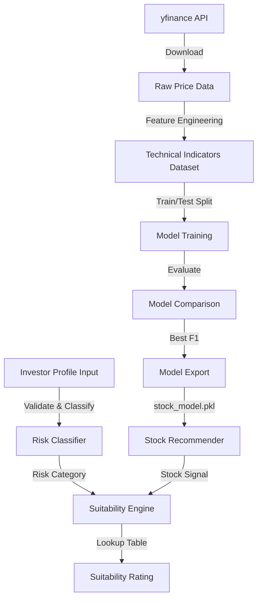

# Design Document: AI-Powered Stock Recommendation System

## Overview

This design describes a university prototype system that classifies investor risk profiles and generates stock recommendations using machine learning. The system has three core components:

1. **Risk Classifier** — Categorizes investors as Conservative, Moderate, or Aggressive based on profile attributes
2. **Stock Recommender** — Predicts Buy/Hold/Avoid signals from technical indicators computed on historical price data
3. **Suitability Engine** — Combines Risk Category and Stock Signal into a final Suitable/Use Caution/Not Suitable rating

The system is implemented in Python, trained in a Jupyter Notebook, and produces serialized models for inference. The architecture prioritizes simplicity and academic clarity over production robustness.

### Key Design Decisions

| Decision | Rationale |
|----------|-----------|
| Rule-based Risk Classifier with adjustments | Simple, deterministic, easy to explain in a report. Meets requirement for clear classification logic. |
| yfinance for data acquisition | Free, no API key required, well-documented for academic use |
| scikit-learn for ML models | Industry-standard, well-documented, suitable for tabular classification |
| Pickle/joblib for serialization | Native Python, simple, meets academic requirements |
| Single notebook for training pipeline | Matches academic submission format, easy to follow linearly |
| Lookup table for suitability mapping | Deterministic 3×3 matrix, no ML needed, fully testable |

## Architecture

The system follows a pipeline architecture with clearly separated stages:



### Module Layout

```
FYP_Project/
├── data/                    # Raw and processed datasets
│   ├── raw/                 # Downloaded stock CSVs
│   └── processed/           # Feature-engineered datasets
├── notebooks/
│   └── training.ipynb       # Complete training pipeline
├── models/
│   ├── stock_model.pkl      # Best performing model
│   └── scaler.pkl           # Fitted StandardScaler (if used)
├── src/
│   ├── __init__.py
│   ├── risk_classifier.py   # Investor risk classification
│   ├── stock_recommender.py # Model loading and prediction
│   ├── suitability.py       # Suitability engine logic
│   ├── features.py          # Feature engineering functions
│   └── validation.py        # Input validation utilities
├── docs/
│   └── report.md            # Project report
└── README.md
```

### Technology Stack

- **Python 3.10+**
- **pandas** — Data manipulation and DataFrames
- **numpy** — Numerical computation
- **yfinance** — Stock price data download
- **scikit-learn** — ML models, metrics, preprocessing
- **matplotlib/seaborn** — Confusion matrix visualization
- **jupyter** — Notebook execution
- **pickle/joblib** — Model serialization

## Components and Interfaces

### 1. Risk Classifier (`src/risk_classifier.py`)

**Responsibility**: Validates investor profile inputs and classifies risk category.

```python
class InvestorProfile:
    age: int            # 18–120
    income: float       # 0.00–999,999,999.99
    horizon: int        # 1–50 years
    experience: int     # 0–50 years
    risk_score: int     # 1–10

class RiskClassifier:
    def classify(self, profile: InvestorProfile) -> str:
        """Returns 'Conservative', 'Moderate', or 'Aggressive'."""
        ...

    def validate(self, profile: InvestorProfile) -> list[str]:
        """Returns list of validation error messages, empty if valid."""
        ...
```

**Classification Algorithm**:
1. Base category from `risk_score`: 1–3 → Conservative, 4–6 → Moderate, 7–10 → Aggressive
2. Adjustment factors (each shifts one level toward Conservative):
   - `age > 60`
   - `horizon < 3`
   - `experience < 2`
3. Category levels: Aggressive → Moderate → Conservative (floor at Conservative)

### 2. Feature Engineering (`src/features.py`)

**Responsibility**: Computes technical indicators from raw OHLCV data.

```python
def compute_features(df: pd.DataFrame) -> pd.DataFrame:
    """
    Computes technical indicators for a single stock DataFrame.
    Requires at least 80 trading days of data.
    Returns DataFrame with: close_price, daily_return, ma_5, ma_20, ma_50,
    volatility, volume, RSI, MACD.
    """
    ...

def compute_target_labels(df: pd.DataFrame) -> pd.Series:
    """
    Computes target labels based on 30-day future returns.
    Buy: > 10%, Hold: 0%–10%, Avoid: < 0%.
    """
    ...
```

**Feature Definitions**:
| Feature | Formula |
|---------|---------|
| `close_price` | Raw adjusted close |
| `daily_return` | `(close[t] - close[t-1]) / close[t-1]` |
| `ma_5` | 5-day SMA of close |
| `ma_20` | 20-day SMA of close |
| `ma_50` | 50-day SMA of close |
| `volatility` | 20-day rolling std of `daily_return` |
| `volume` | Raw volume |
| `RSI` | 14-day RSI using standard Wilder's smoothing |
| `MACD` | EMA(12, close) − EMA(26, close) |

### 3. Stock Recommender (`src/stock_recommender.py`)

**Responsibility**: Loads the trained model and scaler, produces predictions.

```python
class StockRecommender:
    def __init__(self, model_path: str = "models/stock_model.pkl",
                 scaler_path: str = "models/scaler.pkl"):
        """Loads model and optional scaler from disk."""
        ...

    def predict(self, features: dict) -> str:
        """Returns 'Buy', 'Hold', or 'Avoid' given technical indicators."""
        ...
```

### 4. Suitability Engine (`src/suitability.py`)

**Responsibility**: Maps (Risk_Category, Stock_Signal) → Suitability_Rating.

```python
class SuitabilityEngine:
    MAPPING = {
        ("Conservative", "Buy"):   "Use Caution",
        ("Conservative", "Hold"):  "Not Suitable",
        ("Conservative", "Avoid"): "Not Suitable",
        ("Moderate", "Buy"):       "Suitable",
        ("Moderate", "Hold"):      "Use Caution",
        ("Moderate", "Avoid"):     "Not Suitable",
        ("Aggressive", "Buy"):     "Suitable",
        ("Aggressive", "Hold"):    "Suitable",
        ("Aggressive", "Avoid"):   "Use Caution",
    }

    def recommend(self, risk_category: str, stock_signal: str) -> str:
        """Returns Suitability_Rating or raises ValueError."""
        ...
```

### 5. Validation (`src/validation.py`)

**Responsibility**: Shared input validation logic.

```python
def validate_investor_profile(data: dict) -> list[str]:
    """Validates all fields, returns list of error messages."""
    ...

def validate_risk_category(value: str) -> str | None:
    """Returns error message if invalid, None if valid."""
    ...

def validate_stock_signal(value: str) -> str | None:
    """Returns error message if invalid, None if valid."""
    ...
```

### 6. Training Notebook (`notebooks/training.ipynb`)

**Responsibility**: End-to-end pipeline from data download to model export.

**Sections** (in order):
1. Introduction — Title, student info, project overview
2. Data Acquisition — yfinance download for Stock_Universe
3. Feature Engineering — Technical indicator computation
4. Model Training — Train LR, DT, RF with 80/20 stratified split, seed=42
5. Model Evaluation — Per-model metrics and confusion matrices
6. Model Comparison — Side-by-side table, best model selection
7. Model Export — Save best model and scaler to `models/`

## Data Models

### Investor Profile Schema

```python
INVESTOR_PROFILE_SCHEMA = {
    "age": {"type": int, "min": 18, "max": 120, "required": True},
    "income": {"type": float, "min": 0.00, "max": 999_999_999.99, "required": True},
    "horizon": {"type": int, "min": 1, "max": 50, "required": True},
    "experience": {"type": int, "min": 0, "max": 50, "required": True},
    "risk_score": {"type": int, "min": 1, "max": 10, "required": True},
}
```

### Stock Data Schema (Raw)

| Column | Type | Description |
|--------|------|-------------|
| Date | datetime | Trading date |
| Open | float | Opening price |
| High | float | Day high |
| Low | float | Day low |
| Close | float | Closing price |
| Adj Close | float | Adjusted close |
| Volume | int | Trading volume |
| Ticker | str | Stock symbol |

### Feature-Engineered Dataset Schema

| Column | Type | Description |
|--------|------|-------------|
| close_price | float | Adjusted close |
| daily_return | float | Daily % change |
| ma_5 | float | 5-day SMA |
| ma_20 | float | 20-day SMA |
| ma_50 | float | 50-day SMA |
| volatility | float | 20-day rolling std |
| volume | int | Raw volume |
| RSI | float | 14-day RSI (0–100) |
| MACD | float | EMA(12) − EMA(26) |
| target | str | Buy / Hold / Avoid |

### Suitability Mapping Matrix

|  | Buy | Hold | Avoid |
|--|-----|------|-------|
| **Conservative** | Use Caution | Not Suitable | Not Suitable |
| **Moderate** | Suitable | Use Caution | Not Suitable |
| **Aggressive** | Suitable | Suitable | Use Caution |

### Model Artifacts

| File | Content | Format |
|------|---------|--------|
| `models/stock_model.pkl` | Best performing classifier | pickle/joblib |
| `models/scaler.pkl` | Fitted StandardScaler | pickle/joblib |


## Correctness Properties

*A property is a characteristic or behavior that should hold true across all valid executions of a system — essentially, a formal statement about what the system should do. Properties serve as the bridge between human-readable specifications and machine-verifiable correctness guarantees.*

### Property 1: Risk classification follows documented rules

*For any* valid InvestorProfile, the Risk_Classifier SHALL return a classification that matches the documented algorithm: base category from risk_score (1–3 → Conservative, 4–6 → Moderate, 7–10 → Aggressive), then shifted one level toward Conservative for each of age > 60, horizon < 3, or experience < 2, with Conservative as the floor.

**Validates: Requirements 1.1, 1.3**

### Property 2: Valid investor profiles are accepted without errors

*For any* InvestorProfile where age is in [18, 120], income is in [0.00, 999999999.99], horizon is in [1, 50], experience is in [0, 50], and risk_score is in [1, 10], the validate() function SHALL return an empty error list.

**Validates: Requirements 1.2**

### Property 3: Invalid investor profiles report all errors with field names and ranges

*For any* InvestorProfile with N fields (where N ≥ 1) that are missing or outside their valid ranges, the validate() function SHALL return exactly N error messages, each identifying the invalid field by name and stating the accepted range.

**Validates: Requirements 1.4, 1.5**

### Property 4: Feature pipeline produces no NaN values

*For any* raw stock DataFrame with at least 80 trading days and no NaN in Close/Volume columns after initial cleaning, the feature engineering pipeline SHALL produce an output DataFrame containing zero NaN values in any column.

**Validates: Requirements 2.6, 3.2**

### Property 5: Feature computations match mathematical definitions

*For any* stock price series of at least 80 trading days, the computed features SHALL satisfy: ma_5[t] equals the mean of close[t-4:t+1], ma_20[t] equals the mean of close[t-19:t+1], volatility[t] equals the 20-day rolling standard deviation of daily_return, RSI[t] is in [0, 100], and MACD[t] equals EMA(12, close)[t] minus EMA(26, close)[t].

**Validates: Requirements 3.1**

### Property 6: Target labels follow labeling rules

*For any* pair of current close price and close price 30 trading days ahead, the target label SHALL be "Buy" when future_30_day_return > 10%, "Hold" when 0% ≤ future_30_day_return ≤ 10%, and "Avoid" when future_30_day_return < 0%.

**Validates: Requirements 3.3**

### Property 7: Stratified split preserves class proportions

*For any* labeled dataset with at least 3 classes, applying an 80/20 stratified split with seed=42 SHALL produce training and test sets where the class proportion of each label in both sets differs from the original by no more than 1 percentage point.

**Validates: Requirements 4.3**

### Property 8: Best model selection by F1 with tiebreaker

*For any* set of three models with computed weighted F1-scores and accuracies, the selection function SHALL return the model with the highest weighted F1-score, or in case of tied F1-scores, the model with the highest accuracy.

**Validates: Requirements 5.3**

### Property 9: Model serialization round-trip preserves predictions

*For any* trained scikit-learn model, serializing to pickle/joblib and deserializing SHALL produce a model that returns identical predictions on any input feature vector as the original model before serialization.

**Validates: Requirements 6.2**

### Property 10: Suitability mapping matches defined table

*For any* valid (Risk_Category, Stock_Signal) pair from the 9-element domain {Conservative, Moderate, Aggressive} × {Buy, Hold, Avoid}, the Suitability_Engine SHALL return the exact Suitability_Rating defined in the mapping table.

**Validates: Requirements 7.1**

### Property 11: Invalid suitability inputs produce descriptive errors

*For any* string that is not in {Conservative, Moderate, Aggressive} provided as Risk_Category, or any string not in {Buy, Hold, Avoid} provided as Stock_Signal (including case variants), the Suitability_Engine SHALL return an error message identifying which input is invalid and stating the received value.

**Validates: Requirements 7.2, 7.3**

## Error Handling

### Input Validation Errors

| Component | Error Condition | Response |
|-----------|----------------|----------|
| Risk Classifier | Missing or out-of-range fields | Return list of error messages naming each invalid field and its valid range |
| Risk Classifier | Multiple invalid fields | Single response listing ALL invalid fields (not just the first) |
| Suitability Engine | Invalid Risk_Category or Stock_Signal | Error message identifying which input is invalid and what value was received |
| Suitability Engine | None or empty string input | Error message indicating which input is missing |

### Data Pipeline Errors

| Component | Error Condition | Response |
|-----------|----------------|----------|
| Data Acquisition | yfinance exception or empty DataFrame | Log warning with ticker and reason, continue with remaining tickers |
| Data Acquisition | Ticker has < 1000 rows | Log warning indicating insufficient data |
| Feature Engineering | Stock has < 80 trading days | Exclude stock from feature computation (no error raised) |
| Model Export | Filesystem write failure | Raise error message identifying which file failed |

### Error Design Principles

1. **Fail informatively**: All errors include context (field name, value received, expected range)
2. **Report all errors at once**: Validation collects all issues before returning (no early exit)
3. **Graceful degradation in pipeline**: Data acquisition continues on individual ticker failures
4. **Hard failure on critical operations**: Model export failures are raised, not swallowed

## Testing Strategy

### Property-Based Testing

The system uses **Hypothesis** (Python property-based testing library) for verifying universal properties.

**Configuration:**
- Minimum 100 examples per property test
- Use `@given` decorators with custom strategies for domain types
- Tag format: `# Feature: ai-stock-recommendation, Property {N}: {title}`

**Targeted Properties (from Correctness Properties section):**

| Property | Component Under Test | Strategy |
|----------|---------------------|----------|
| 1: Classification rules | `RiskClassifier.classify()` | Generate random valid profiles, verify against rule implementation |
| 2: Valid profiles accepted | `RiskClassifier.validate()` | Generate profiles within valid ranges, verify empty error list |
| 3: Invalid profiles report errors | `RiskClassifier.validate()` | Generate profiles with N invalid fields, verify N errors returned |
| 4: No NaN in output | `compute_features()` | Generate random price series (80+ days), verify no NaN |
| 5: Feature math correctness | `compute_features()` | Generate price series, independently compute expected values |
| 6: Target label rules | `compute_target_labels()` | Generate price pairs, verify label matches threshold rules |
| 7: Stratified split | train/test split utility | Generate labeled datasets, verify proportions preserved |
| 8: Best model selection | model comparison function | Generate random score triples, verify correct selection |
| 9: Serialization round-trip | model save/load | Train small model, save, reload, compare predictions |
| 10: Suitability mapping | `SuitabilityEngine.recommend()` | Enumerate all 9 valid pairs, verify against table |
| 11: Invalid suitability inputs | `SuitabilityEngine.recommend()` | Generate random invalid strings, verify error content |

### Unit Testing (Example-Based)

Example-based tests complement property tests for specific scenarios:

- **Data Acquisition**: Mock yfinance, verify schema and error handling
- **Feature Engineering**: Known price series with hand-computed expected features
- **Model Training**: Verify correct hyperparameters and preprocessing steps applied
- **Confusion Matrix**: Verify visualization labels and titles
- **Notebook Structure**: Verify section ordering and markdown cell presence

### Integration Testing

- **End-to-end pipeline**: Run notebook on cached data, verify model file is produced
- **Model load and predict**: Load saved model, predict on test data, verify output format
- **Scaler consistency**: Verify scaler transforms match training-time transforms

### Test Organization

```
tests/
├── properties/
│   ├── test_risk_classifier_props.py
│   ├── test_features_props.py
│   ├── test_suitability_props.py
│   └── test_model_selection_props.py
├── unit/
│   ├── test_risk_classifier.py
│   ├── test_features.py
│   ├── test_suitability.py
│   ├── test_stock_recommender.py
│   └── test_validation.py
└── integration/
    ├── test_pipeline.py
    └── test_model_export.py
```

### Testing Tools

- **pytest** — Test runner
- **hypothesis** — Property-based testing library
- **pytest-cov** — Coverage reporting
- **unittest.mock** — Mocking yfinance and filesystem operations
